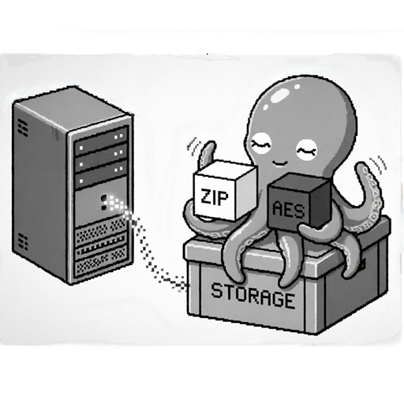

# Backup System — quick guide

**Platforms:** Windows · Linux  
**backup-client UI languages:** English, Русский, Deutsch, Français, 中文 (简体)

**Components:** `backup-client` · `backup-monitor` · `backup-server` · `backup-decrypt`  
**Version:** 1.0.0 · **License:** [MIT](LICENSE)

> Full documentation: [User Manual](client/docs/manual.html)

<p align="center">
  
</p>

---

## Overview

Distributed backup for **your VPS servers**: each server runs **backup-server**; your PC runs **backup-client** (scheduling and downloads). Traffic uses **TLS (WSS + HTTPS)** with your own CA — no public CA or domain required.

Optional: **backup-monitor** (terminal status) and **backup-decrypt** on USB (decrypt `.aes` away from the backup PC).

---

## Five protection layers

Each layer is **optional** except TLS in normal use. You choose how many to enable.

| # | Layer | What it does |
|---|-------|--------------|
| **1** | **TLS + pinning** | Your CA, per-VPS certificate, client accepts only known fingerprint. Backups are not sent in the clear. |
| **2** | **`device_id`** | Server accepts only your backup PC (hardware fingerprint, not stored in client files). A copy of the client on another PC cannot connect. |
| **3** | **Secrets: Production** | DB passwords only on the server in `backup.db`; after sync the client keeps task names and cron without `db_pass`. |
| **4** | **Encrypt mode (AES)** | Server encrypts archives before download → client disk gets `*.aes`, not readable ZIP. Password is `encrypt_password` on **that** VPS. |
| **5** | **backup-decrypt on USB** | Decryption passwords off the backup PC; decrypt only when needed from a USB stick. |

For important data, **1 + 2 + 3 + 4** is typical; layer **5** helps when `.aes` archives sit on a network share or long-term storage.

---

## Quick start (one VPS test)

### Step 0 — downloads

From [GitHub Releases](https://github.com/geniden/backup/releases):

- **Backup machine:** `backup-client` (+ optional `backup-monitor`)
- **Each VPS:** `backup-server` (Linux musl or Windows)

Or build from source — see [README.md](README.md) and `build-all.ps1` / `build-all.sh`.

### Step 1 — client, first connection

1. Unpack `backup-client` e.g. `C:\backup-client\` or `/opt/backup-client/`.
2. Run **`backup-client`** (interactive menu).
3. **Add connection** → latin **slug** (e.g. `production`) → VPS address `203.0.113.10:8080` (your server IP).
4. Client creates deploy bundle **`data/ca/{slug}/`** (TLS, `config.toml`, `service.sh`, `README.txt`).

### Step 2 — deploy on VPS (Linux)

Recommended path: **`/opt/backup-server/`**

Copy **contents** of `data/ca/{slug}/` **and** the `backup-server` binary into one directory:

```
/opt/backup-server/
  backup-server          ← Linux binary (chmod +x)
  config.toml            ← from client bundle
  service.sh             ← from bundle
  README.txt
  tls/
    server.crt
    server.key           ← chmod 600
  data/
    temp/                ← created automatically
    scripts/             ← for shell tasks (optional)
```

Start:

```bash
cd /opt/backup-server
chmod +x backup-server service.sh
chmod 600 tls/server.key
sudo ./service.sh          # systemd (recommended)
# or trial run: ./backup-server
```

### Step 3 — verify

1. In client: open connection → **Test connection**.
2. Success: certificate accepted, **device_id** registered on server.
3. **Add task** — e.g. `mysql_dump` or `files_archive`, test cron `*/5 * * * *` (every 5 min).
4. **Run task manually** from the menu — confirm file appears in  
   **`data/backups/{slug}/`** next to `backup-client`.

**Tip:** multiple tasks on one VPS — stagger cron minutes (0, 5, 10, 15…), not all at once.

### Step 4 — scheduler (production)

```text
backup-client serve
```

Or systemd / Windows service. Optionally in a second terminal: **`backup-monitor`**.

---

## Basic security (layers 1–2)

### TLS

Created automatically on **Add connection**. Root CA: `data/ca/root.crt` + **`root.key`** — keep only on the backup PC, never publish.

### `device_id` — moving to a new backup PC

Bound to **one** PC with the client. To allow a **new** computer:

1. On **VPS** in `config.toml` clear: `device_id = ""`
2. Restart `backup-server`
3. From the **new** PC: **Test connection** — server stores the new `device_id`

The old PC cannot connect until you reset `device_id` again.

---

## Hardening: DB passwords on server only (layer 3)

While configuring tasks — **Secrets: Test** (passwords in client `backup.db`).

When everything works:

1. Connection menu → **Secrets mode: Production**
2. **Test connection** (sync) — dump passwords **removed from client**, kept on server in `backup.db`

To change a DB password in Production: edit task on client → new password → sync.

---

## Hardening: archive encryption (layers 4–5)

### Why

Even if the backup PC or NAS is stolen/copied — **`*.aes`** files are useless without the VPS password and **backup-decrypt**.

### Setup

1. On **each VPS** in `config.toml`: `encrypt_password = "..."` (different password **per server** recommended).
2. In client: task → **Encrypt mode: on** → restart `backup-server` after config change.
3. On client disk: `backup_site_mysql_2026-07-05_120000.zip.aes` instead of `.zip`.

### Network drive / S3 / NAS

Client menu: **Settings → Backups download folder** — mounted path (e.g. `Z:\backups` or `/mnt/nas/backups`).  
Client stores **encrypted** `.aes` — compromised storage does not expose dumps without the VPS password and **backup-decrypt**.

### backup-decrypt (USB)

1. Build or download **backup-decrypt**, copy to USB with **`decrypt.toml.example`** → rename to `decrypt.toml`.
2. For **multiple VPS** — different passwords:

```toml
path = "E:/backups"
[profiles]
production = "encrypt_password from production VPS"
staging    = "encrypt_password from staging VPS"
```

3. When you need plaintext — plug in USB, run **backup-decrypt**, pick the `.aes` file.  
   Do **not** store decryption passwords on the backup PC.

Details: [manual — decrypt](client/docs/manual.html#decrypt).

---

## Components (summary)

| Program | Where |
|---------|-------|
| backup-client | Your PC / backup server |
| backup-monitor | Same machine (optional) |
| backup-server | Each VPS |
| backup-decrypt | USB, not on scheduler machine |

---

## Build from source

Requires **Rust 1.70+** ([latest stable](https://rust.rust-lang.org/) recommended).  
`edition = "2021"` in Cargo.toml is the **Rust language edition**, not a calendar year.

Windows: **`build-all.ps1`** → **`dist/win64/`**  
Linux (WSL): **`build-all.sh`** → **`dist/linux-musl/`**

---

## Disclaimer

This software is a **toolkit** for protecting your data. Security and data safety are **the administrator's responsibility**.  
The author is not liable for loss, leakage, or corruption of data.  
[MIT License](LICENSE) · details: [manual — License](client/docs/manual.html#license).

**Author:** Emelyanov Anton · [geniden@gmail.com](mailto:geniden@gmail.com) · [github.com/geniden/backup](https://github.com/geniden/backup)
