# Backup System — настройка за один вечер

Дружелюбный гайд: неттоп + VPS + первый бэкап · v1.0.0

**~15 мин до первого бэкапа** · Windows client · Linux server · опционально USB decrypt

Полный справочник: [manual.html](../client/docs/manual.html) · [PAGE.md](../PAGE.md) · [Releases](https://github.com/geniden/backup/releases)

**English version:** [TUTORIAL.en.md](TUTORIAL.en.md) · HTML для офлайн: [tutorial.ru.html](tutorial.ru.html)

---

## Содержание

1. [Как я делаю бэкапы](#как-я-делаю-бэкапы)
2. [Неттоп и дистрибутивы](#неттоп-и-дистрибутивы)
3. [Часть 1 — клиент и сервер](#часть-1--клиент-и-сервер)
4. [Часть 2 — задачи и планировщик](#часть-2--задачи-и-планировщик)
5. [Часть 3 — продакшн и шифрование](#часть-3--продакшн-и-шифрование)
6. [Мониторинг](#мониторинг)
7. [Грабли](#грабли)

---

## Как я делаю бэкапы

Обслуживаю сайты и сервера небольших компаний — SaaS и интернет-магазины. Нужны бэкапы БД и файлов. Слепок всего диска — слишком тяжёлый; обычно хватает дампа MySQL и архива каталога магазина.

Можно поставить backup-client на VPS, но надёжнее держать архивы **у себя** на отдельной машине, а не «где-то в облаке».

- Бэкапы на отдельном неттопе — не шумит, потребление ~35 W
- Свой `device_id` на backup-PC
- В продакшн-режиме пароли БД на сервере, не на клиенте
- AES + ключи на флешке (backup-decrypt)

### Пять уровней защиты

1. **TLS** — свой CA, WSS + HTTPS
2. **Encrypt mode** — AES на сервере → на диске `*.aes`
3. **device_id** — сервер принимает только ваш backup-PC
4. **Secrets: Production** — пароли БД только на backup-server
5. **backup-decrypt на USB** — пароли расшифровки не на неттопе

---

## Неттоп и дистрибутивы

### Железо

**HP ProDesk 260 G2** (б/у, ~$50–75): i3-6100, 16 GB RAM, SSD 256 GB, бесшумный, ~35 W.

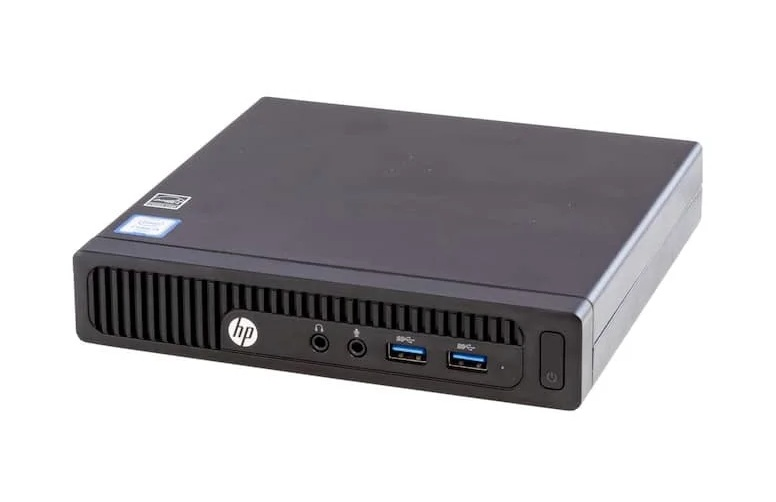

### Скачать

[GitHub Releases](https://github.com/geniden/backup/releases):

- Неттоп (Windows): `backup-client-1.0.0-windows-x64.zip`
- VPS (Linux): `backup-server-1.0.0-linux-x64-musl.tar.gz`
- USB (опционально): `backup-decrypt-1.0.0-windows-x64.zip`

Распаковка на диске `C:\backup\`:

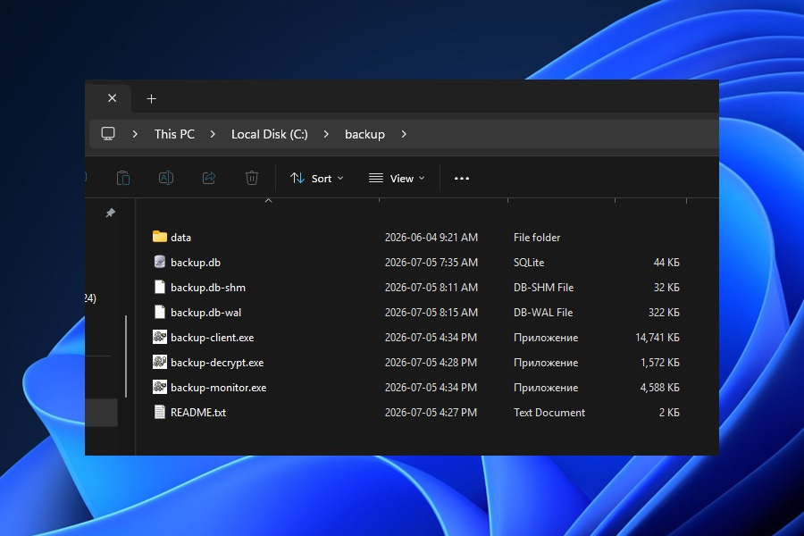

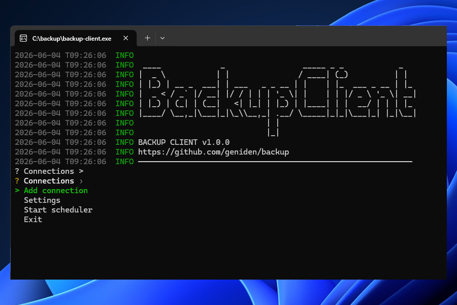

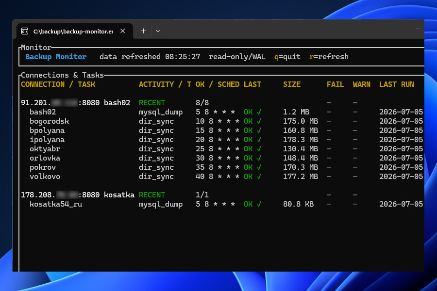

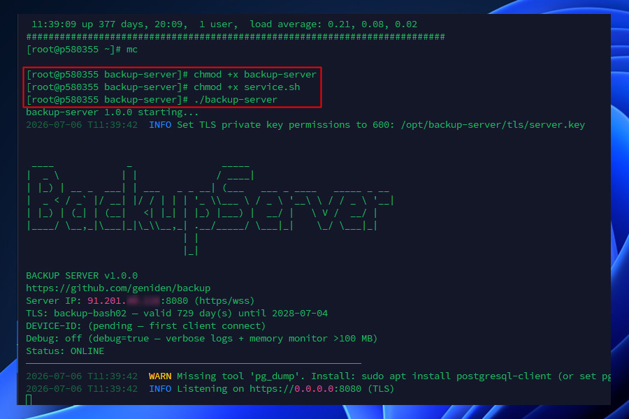

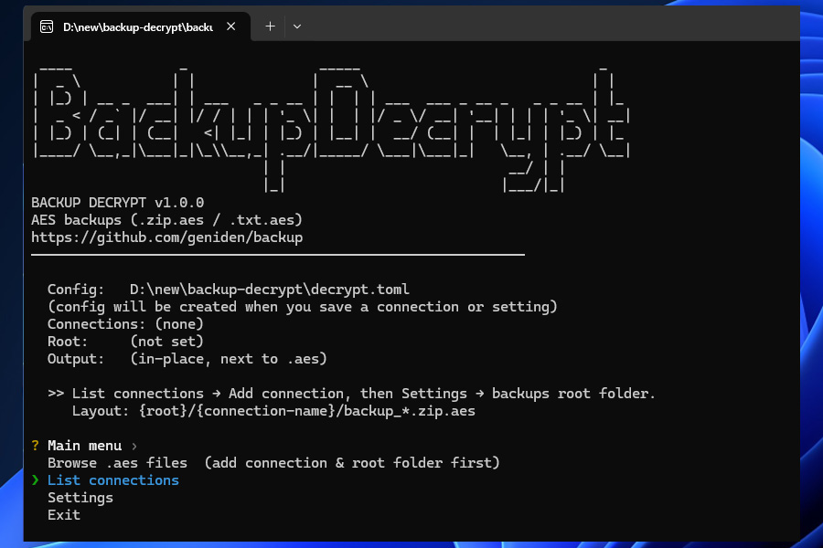

---

## Часть 1 — клиент и сервер

### 1.1. Первый запуск

Запусти `C:\backup\client\backup-client.exe`

**Настройки → Язык** — English, Deutsch, Français, Русский, 中文.

### 1.2. Добавить подключение

**Подключения → Добавить подключение**

На «Проверить подключение сейчас?» — **n** (сервер ещё не поднят).

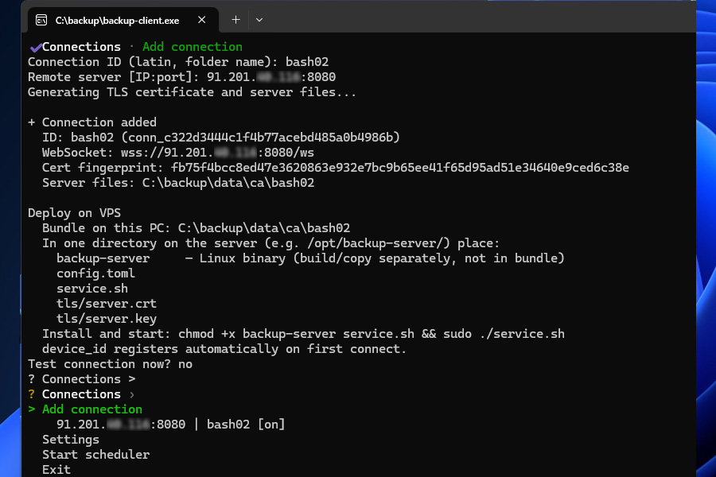

```
C:\backup\client\data\ca\bash02\
├── config.toml
├── tls\          (server.crt, server.key)
├── service.sh
└── README.txt
```

> **TLS** — личный CA, не публичный. Папка `ca\bash02\` — всё для VPS в одном месте.

### 1.3. Копирование на VPS

> **FileZilla** на моём опыте иногда **ломает** Linux-бинарник (`Exec format error`). Надёжно: **WinSCP (Binary)**, **FAR + SFTP**, **scp** из PowerShell. После копирования: `file backup-server` → `ELF 64-bit … statically linked`.

```bash
mkdir -p /opt/backup
```

```powershell
scp -r C:\backup\client\data\ca\bash02\* user@203.0.113.10:/opt/backup/
scp C:\backup\server\backup-server user@203.0.113.10:/opt/backup/
```

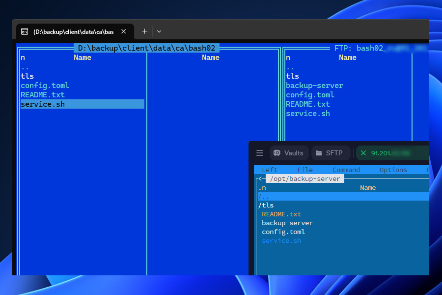

### 1.4. Запуск на VPS

```bash
cd /opt/backup
chmod +x backup-server service.sh
./backup-server
```

`chmod 600 tls/server.key` — обычно **не нужен**: backup-server и service.sh выставят сами. Если сервер ругается на ключ — сделай вручную.


```bash
sudo ./service.sh
sudo systemctl status backup-server
```

#### Шпаргалка systemctl

| Команда | Действие |
|---------|----------|
| `sudo systemctl start backup-server` | Запустить |
| `sudo systemctl stop backup-server` | Остановить |
| `sudo systemctl restart backup-server` | После правки config.toml |
| `sudo systemctl enable backup-server` | Автозапуск при загрузке Linux |
| `sudo journalctl -u backup-server -f` | Логи в реальном времени |

```bash
free -h    # память
df -h      # диск
uptime     # нагрузка
```

### 1.5. Проверка с клиента

**Подключения → bash02 → Проверить подключение**

При первом успехе сервер сохраняет `device_id` этого ПК в `config.toml`.

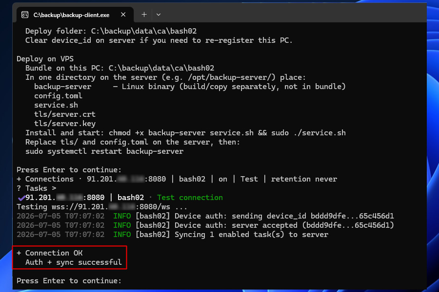

Сменить backup-PC: на VPS `device_id = ""` → `systemctl restart backup-server` → проверка с нового ПК.

```bash
# Ограничить порт только IP клиента (пример UFW)
sudo ufw allow from ТВОЙ_IP to any port 8080 proto tcp
```

---

## Часть 2 — задачи и планировщик

### 2.1. Добавить задачу

**Подключения → bash02 → Добавить задачу**

Настройка задач — ядро системы: тип, параметры и **расписание** определяют, что и когда копируется с VPS. Остальные пункты меню (планировщик, шифрование) работают поверх уже созданных задач.

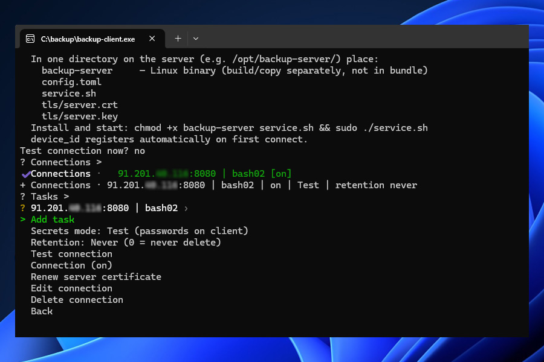

| Тип | Когда |
|-----|-------|
| mysql_dump | MySQL / MariaDB |
| postgresql_dump | PostgreSQL |
| files_archive | Папка сайта, конфиги |
| sqlite_dump | Файл SQLite |
| shell | Свой .sh в data/scripts/ |
| dir_sync | Инкремент (без AES) |

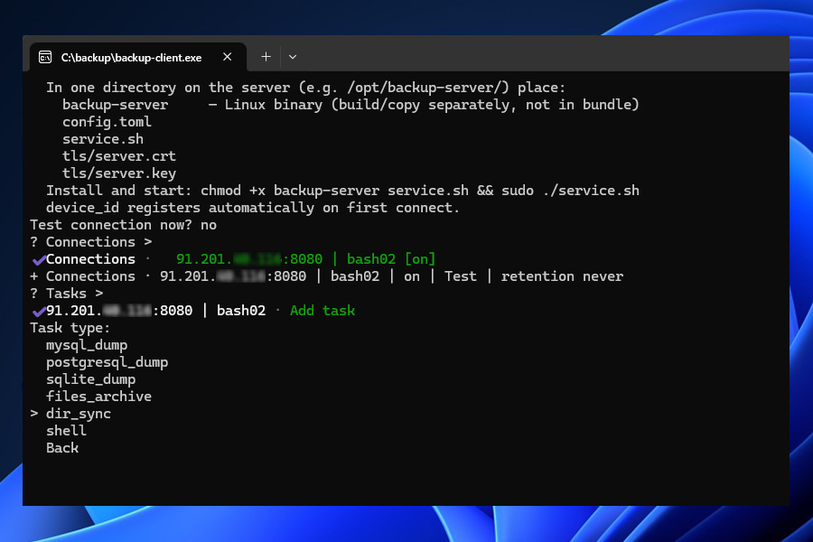

#### Расписание (cron)

При вводе клиент показывает подсказку по полям. После сохранения вы увидите полное выражение, например `→ сохранено как: 0 8 * * *`.

Формат — **5 полей**: минута · час · день месяца · месяц · день недели. Звёздочки `*` («каждый») можно **не вводить** — недостающие поля дополняются автоматически. Запись `/N` понимается как `*/N` (каждые N единиц в этом поле).

| Что ввести | Сохранится как | Когда запуск |
|------------|----------------|--------------|
| `*/5` | `*/5 * * * *` | каждые 5 минут (для теста) |
| `0 8` | `0 8 * * *` | ежедневно в 08:00 |
| `0 2` | `0 2 * * *` | ежедневно в 02:00 |
| `0 /2` | `0 */2 * * *` | каждые 2 часа (в :00) |
| `*/60` или `/60` | `0 * * * *` | каждый час |
| `*/120` | `0 */2 * * *` | каждые 2 часа |
| `*/30 * * * *` | — | каждые 30 минут |
| `0 0 * * 0` | — | каждое воскресенье в полночь |

> **Несколько задач на одно время:** Если много задач (5–10 и больше) стартуют в **одну и ту же минуту**, сервер может не успеть принять всё в очередь — часть запусков будет **пропущена** (в логе: «ПРОПУЩЕНА в этот запуск»). Разносите задачи **хотя бы по минутам**: первая в минуту `0`, вторая в `1`, третья в `2`… Или с шагом 5: `0`, `5`, `10` в том же часу. Пример для трёх дампов БД утром: `0 8 * * *`, `1 8 * * *`, `2 8 * * *`.

#### Пути к папкам на VPS

Только типы **files_archive** и **dir_sync** работают с файлами на сервере напрямую — в параметрах задачи нужен **абсолютный путь** к каталогу. Остальные типы (дампы БД, sqlite, shell) используют свои поля (хост БД, скрипт и т.д.).

Чтобы узнать путь на VPS для нужной папки, зайдите по SSH и выполните:

```bash
cd /var/www/site && pwd
```

Вывод (например `/var/www/site`) — подставьте в параметр пути при создании задачи.

### 2.2. Ручной запуск

**Задача → Запустить сейчас (ручной тест)**

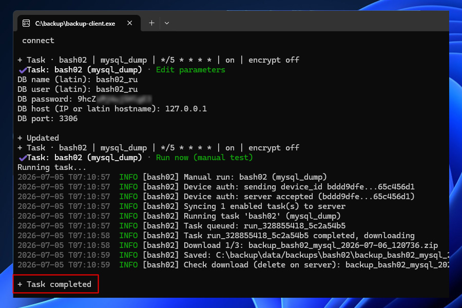

```
C:\backup\client\data\backups\bash02\
  backup_....zip
```

### 2.3. Планировщик 24/7

**Запустить планировщик** или `backup-client.exe serve`

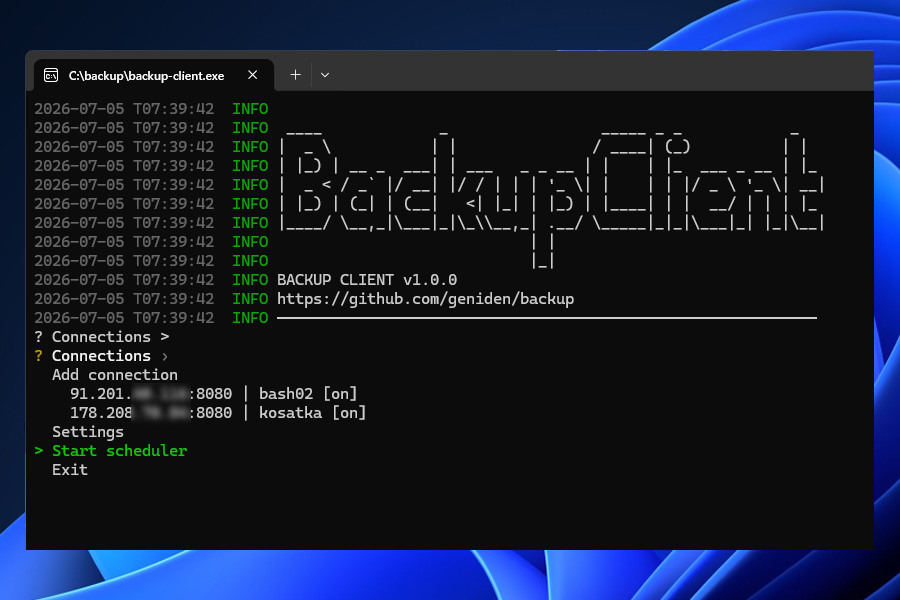

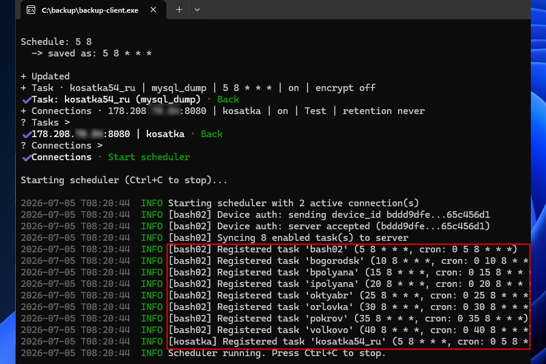

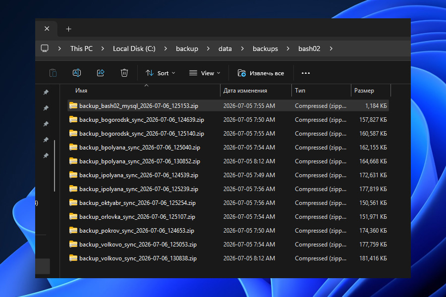

### 2.4. Автозапуск Windows

**Win+R** → `taskschd.msc` → Создать задачу:

- Программа: `C:\backup\client\backup-client.exe`
- Аргументы: `serve`
- Рабочая папка: `C:\backup\client`
- Триггер: при запуске или при входе

Проще (только после логина): `shell:startup` → ярлык с `serve`.

```powershell
Get-Content C:\backup\client\data\backup.log -Wait -Tail 30
```

---

## Часть 3 — продакшн и шифрование

### 3.1. Режим секретов: Продакшн

Когда всё работает: в меню подключения переключи **Режим секретов: Продакшн**, затем **Проверить подключение**. Пароли dump-задач уходят с клиента, остаются на сервере.

### 3.2. Шифрование (Encrypt mode)

**Как устроен пароль шифрования**

- У **каждого подключения** (каждого VPS) может быть свой `encrypt_password` в `config.toml` на сервере. Клиент только включает **Шифрование (Вкл.)** на задаче — сам пароль на backup-PC не хранится.
- Пароль знают только **backup-server** (шифрует архив перед отправкой) и тот, кто его задал. Можно придумать свой passphrase или сгенерировать случайный в **backup-decrypt** и скопировать то же значение на сервер.

`backup-decrypt.exe` → **List connections** → **Add connection** → имя `bash02` (как slug) → программа покажет пароль.


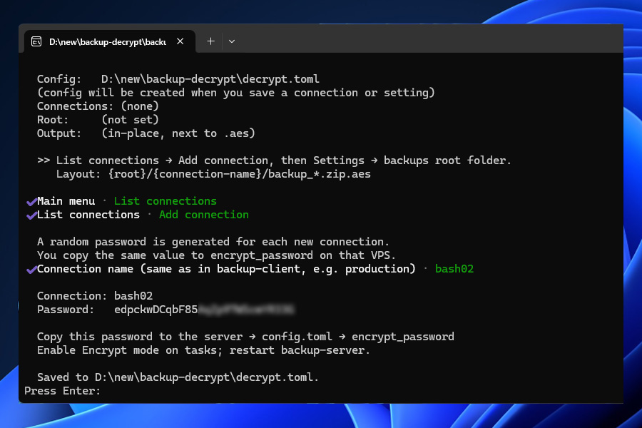

На VPS в `/opt/backup/config.toml`:

```toml
encrypt_password = "тот_же_пароль"
```

```bash
sudo systemctl restart backup-server
```

В backup-client: **Задачи → … → Шифрование (Вкл.)** — на диске будут `*.zip.aes`, не открытый zip.

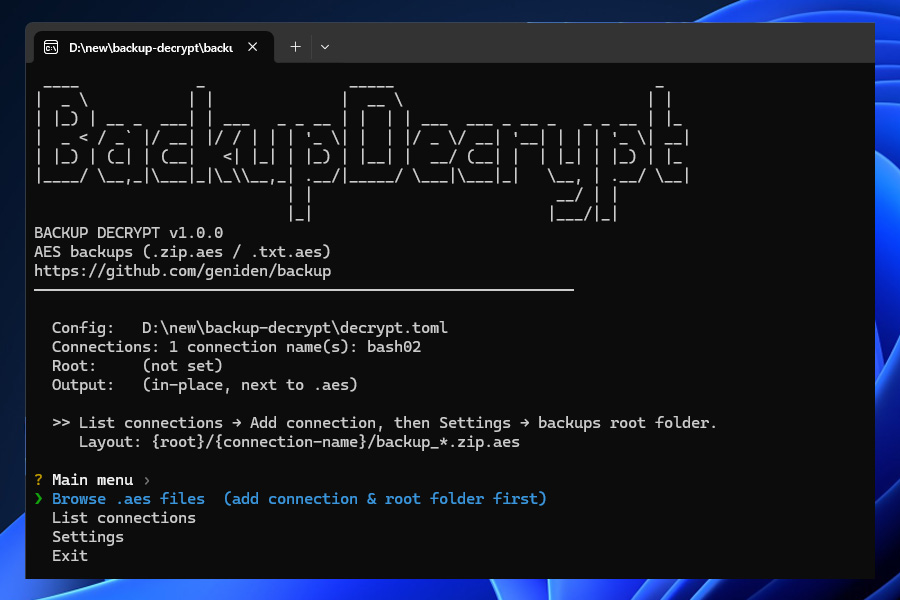

> **decrypt.toml** с паролями — на USB, не на неттопе с планировщиком.

---

## Мониторинг

- Файлы в `data\backups\bash02\`
- Лог клиента без ERROR/WARN
- `backup-monitor.exe` — статус задач


---

## Грабли

| Проблема | Решение |
|----------|---------|
| FileZilla / битый бинарник | WinSCP Binary, FAR, scp; `file backup-server` |
| device_id / другой ПК | `device_id = ""` на сервере, restart |
| mysqldump not found | `which mysqldump` → config.toml на сервере |
| Encrypt skip | Пустой encrypt_password на сервере |
| Нет файла на клиенте | Запущен ли serve / Task Scheduler? |

---

Backup System v1.0.0 · [github.com/geniden/backup](https://github.com/geniden/backup)

Офлайн HTML: [tutorial.ru.html](tutorial.ru.html)
